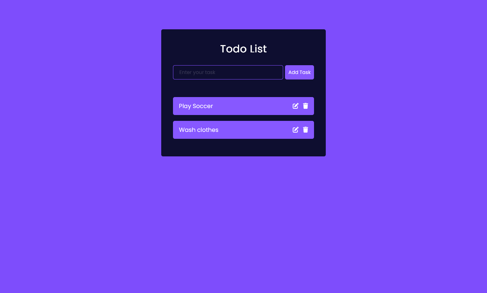

<h1 align="center">{Todo List App by sotun}</h1>

<div align="center">
  <h3>
    <a href="https://github.com/Sotun-1010/React_Todo_list">
      Github Repo
    </a>
    <span> | </span>
    <a href="https://todolistapp-by-sotun.netlify.app/">
      Live Demo
    </a>
  </h3>
</div>

<!-- TABLE OF CONTENTS -->

## Table of Contents

- [Overview](#overview)
  - [Built With](#built-with)
- [How to use](#how-to-use)
- [Contact](#contact)

<!-- OVERVIEW -->

## Overview



Introduce your projects by taking a screenshot or a gif. Try to tell visitors a story about your project by answering:

- What was your experience? I improved on my understanding of react. Worked with and learnt more about props and states, also structuring component layouts(basically learning how to think in components). Looking to get better working with react henceforth.
- What have you learned/improved? My knowledge of Tailwind and basics of react
- Your wisdom? :) Just do it. 

### Built With

<!-- This section should list any major frameworks that you built your project using. Here are a few examples.-->

- [Vite] (<https://vitejs.dev/>)

## How To Use

<!-- Example:  -->

To clone and run this application, you'll need [Git](https://git-scm.com) and [Node.js](https://nodejs.org/en/download/) (which comes with [npm](http://npmjs.com)) installed on your computer. From your command line:

```bash
# Clone this repository
$ git clone 

# Install dependencies
$ npm install

# Run the app
$ npm start
```

## Contact

- GitHub [@Sotun-1010](https://github.com/Sotun-1010)
- Twitter [@O_G_Sotun](https://twitter.com/O_G_Sotun?t=kRiO1YNhYKn8NJJnxTZ42A&s=03)